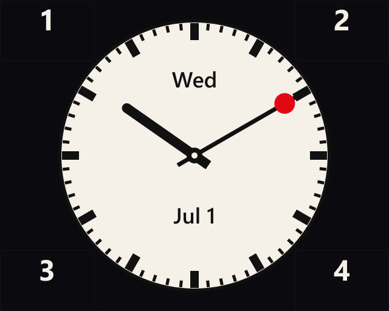
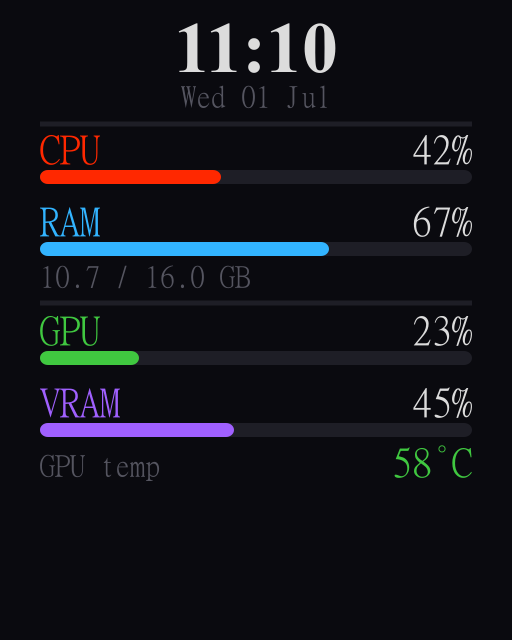
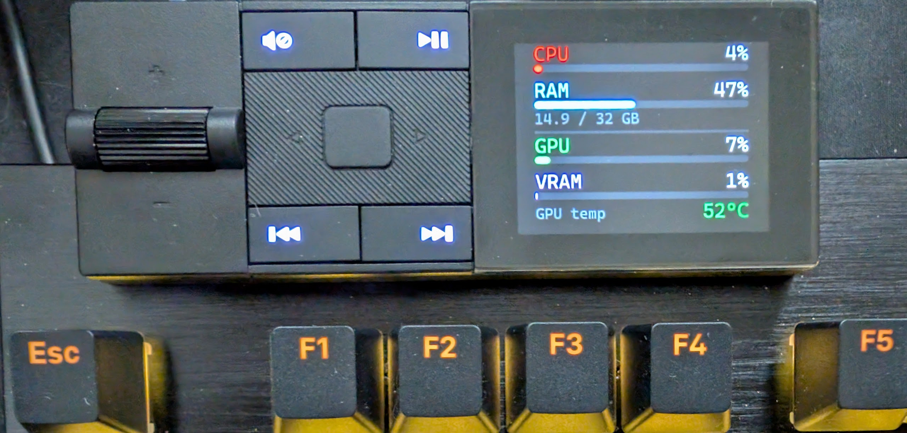

# Idle Images for be Quiet! Media Dock

## The Plan
Replace the `generate.js` script with different templates to display user designed image content. Start things off with a simple analog clock updating every minute.

## Configuration

Copy `config.example.json` to `config.json` and edit as needed:

```json
{
  "generator": "clock",
  "intervalMs": 30000,
  "complications": {
    "cornerTopLeft": true,
    "cornerTopRight": true,
    "cornerBottomLeft": true,
    "cornerBottomRight": true,
    "dayOfWeek": true,
    "date": true
  }
}
```

| Parameter | Values | Description |
|-----------|--------|-------------|
| `generator` | `"clock"` \| `"stats"` | Which image template to render |
| `intervalMs` | milliseconds | Upload interval in `automate.js` (default 60s) |
| `complications.*` | boolean | Clock-only overlay slots (see below) |

`generate.js` reads `config.json` and dispatches to the selected generator. `automate.js` uses the same config for `intervalMs`.

**Note:** the clock template is 640×512 (landscape); the stats template is 512×640 (portrait). Switching `generator` changes the dock orientation.

## Analog Clock

`generate_clock.js` — Deutsche Bahn-style analog watchface with optional complications.



### Complications

Static overlay slots on the clock face (configured via `complications` in `config.json`):

- **Four corners** (155×100 px each): placeholder digits 1–4 when enabled
- **Above centre** (half the face radius): short day of week, e.g. `Thu`
- **Below centre** (half the face radius): abbreviated date, e.g. `Jun 28`

Recommended `intervalMs`: **30000** — depending on the start time, higher values can make minute updates feel laggy.

## System Stats (legacy)

`generate_stats.js` — original stats dashboard from [bequiet-darkmount-mediadock-stats](https://github.com/MikeAndrews90/bequiet-darkmount-mediadock-stats). Set `"generator": "stats"` to use it.



## Preview images

Generate preview PNGs without sharp (requires ImageMagick `convert` on PATH):

```
npm run preview              # uses generator from config.json
npm run preview:clock        # clock at 10:10 → preview_clock.png
npm run preview:stats        # stats with mock data → preview_stats.png
```

Or directly:

```
node preview.js clock --time 10:10 --out preview_clock.png
node preview.js stats --out preview_stats.png
```

## Tests

```
npm test
```

Runs unit tests (Node built-in `node:test`) for config loading, complication layout, geometry, and clock SVG output. No ImageMagick required for tests.

---

Original README content below this line.
--
*(Source: https://github.com/MikeAndrews90/bequiet-darkmount-mediadock-stats)*

# keyboard-stats

Displays live system stats on the be quiet! Dark Mount keyboard's media dock LCD, updated every 20 seconds.



## How it works

A Node.js script generates a stats image as a PNG, then uses browser automation (Playwright + Chromium) to upload it to the official [be quiet! IOCenter web app](https://iocenter.bequiet.com/), which pushes it to the keyboard over WebHID.

## Requirements

- Windows (GPU stats use PowerShell performance counters)
- Node.js 18+
- A be quiet! Dark Mount keyboard
- NVIDIA GPU recommended — GPU %, VRAM %, and temperature are read via `nvidia-smi`. The display degrades gracefully if it isn't found (CPU and RAM still show).

## Installation

```
npm install
npx playwright install chromium
```

## First run

On first run the browser needs to connect to the keyboard. WebHID requires a one-time manual approval that can't be automated:

```
node automate.js
```

1. The browser will open and navigate to iocenter.bequiet.com
2. If prompted, dismiss the welcome popup
3. When you see "No Device detected", the script will click **Find Device** automatically
4. Select your keyboard in the browser's HID picker and click **Connect**
5. The script takes over from here — the browser minimises and runs in the background

The keyboard permission is saved in `.chromium-profile/` so subsequent runs are fully automatic.

## Normal usage (background)

Double-click `start-background.vbs`. A browser window will briefly appear while it connects to the keyboard, then automatically minimise to the taskbar. Stats update every 20 seconds from that point.

Logs are written to `automate.log`.

To stop: end the `node.exe` process in Task Manager, or run:
```
taskkill /f /im node.exe
```

To check on it or intervene, click the Chromium icon in the taskbar or open `http://localhost:9222` in any Chrome window for remote DevTools.

## Disclaimer

This project automates the official be quiet! IOCenter web interface. It is not affiliated with or endorsed by be quiet!. Use at your own risk — web automation may break if the site is updated.
